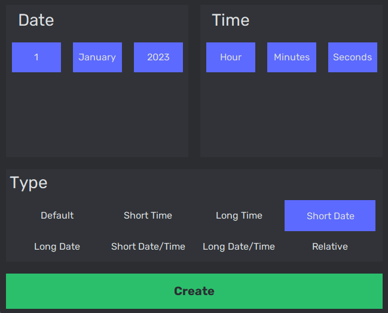
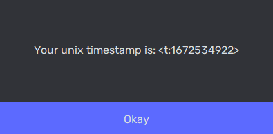

# DUnix
With this program you can create a simple unix timestamp for Discord using a simple GUI.

# Installation

## Executeable (Windows only)
Download the repository and execute the [dunix.exe](dist/dunix.exe) file inside the [dist](dist/) folder.


## Build yourself
This program only uses built-in python libraries, so a python installation is enough to build it. (Tested and built with version `3.11.2`) <br>
1. Download the repo to your local machine <br>
2. Open a local terminal
3. Navigate to the repository in your terminal
4. Run the python command in your terminal, depending on your operating system <br>

<br>
Windows:

```console
python main.py
```
<br>
Linux / MacOS:

```console
python3 main.py
```

# Usage


## Specifying the date
To specify the date just click on one of the three option menus and select the day, month and year of your desired timestamp.

## Specifying the time
To specify the time just click on the specific entry of the hour, minutes or seconds and type the time you want.

## Choosing the type
To specify the type your timestamp should represent, just click one of the radiobuttons.

## Create
Click the create button once you selected the date, time and type and a popup will appear containing your unix timestamp. <br>


# Modifying the program

## Year
The year option menu shows a range of 40 years, 15 years to the past and 25 years into the future. If you want to access earlier or later years change the constants `YEARS_PAST` or `YEARS_FUTURE` respectfully. <br>
 > Note: `YEARS_PAST` must be negative
